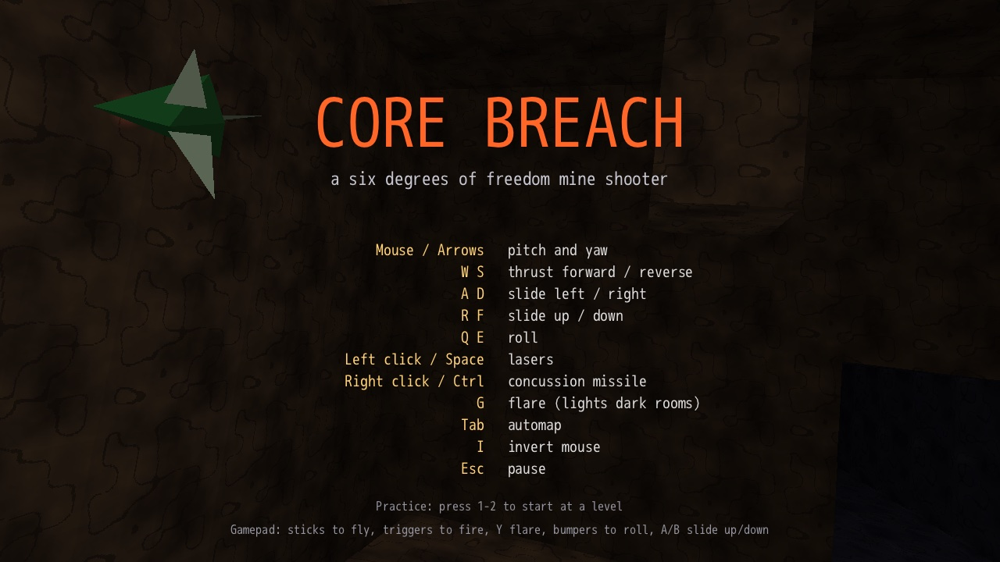
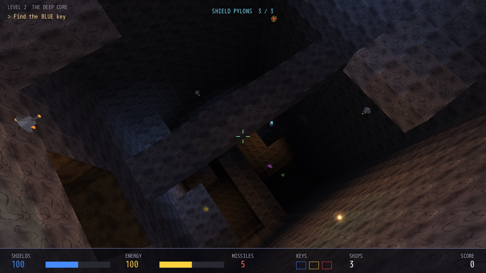
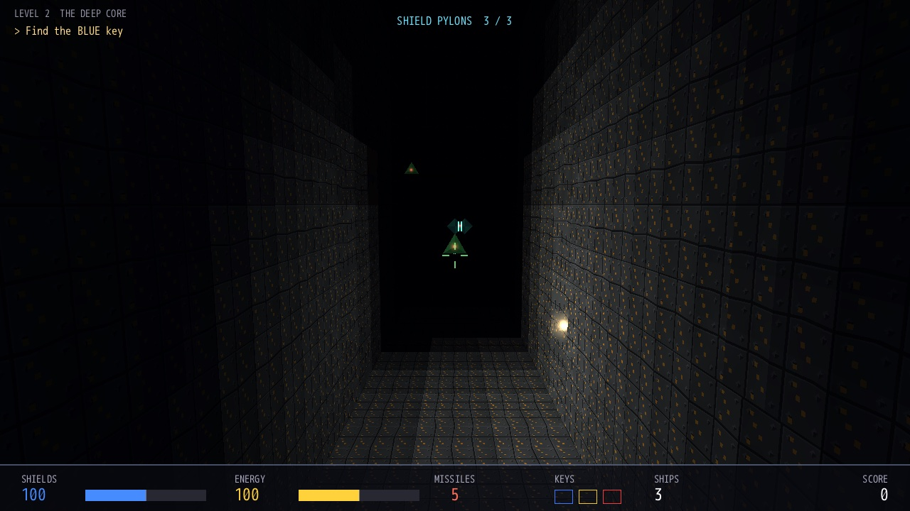
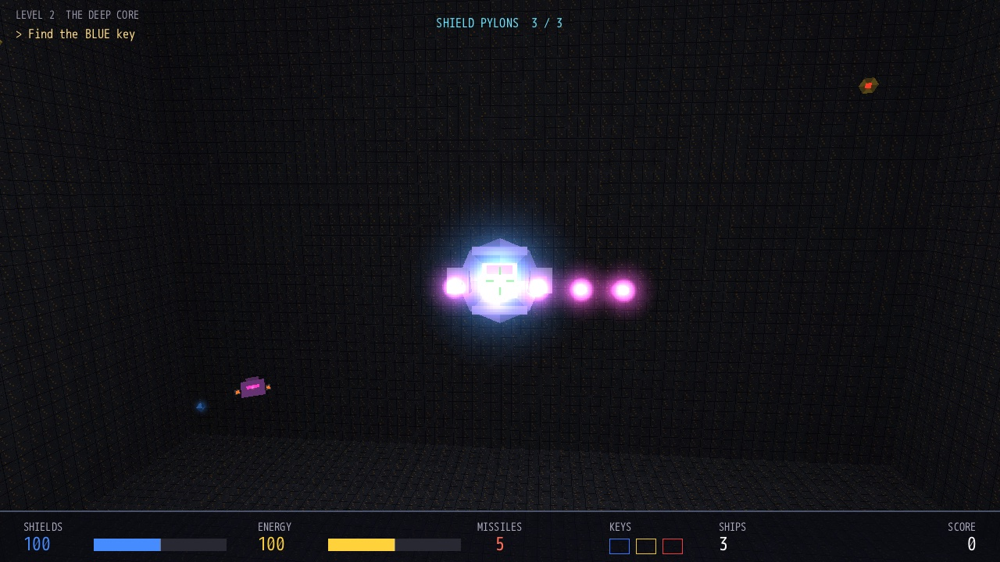
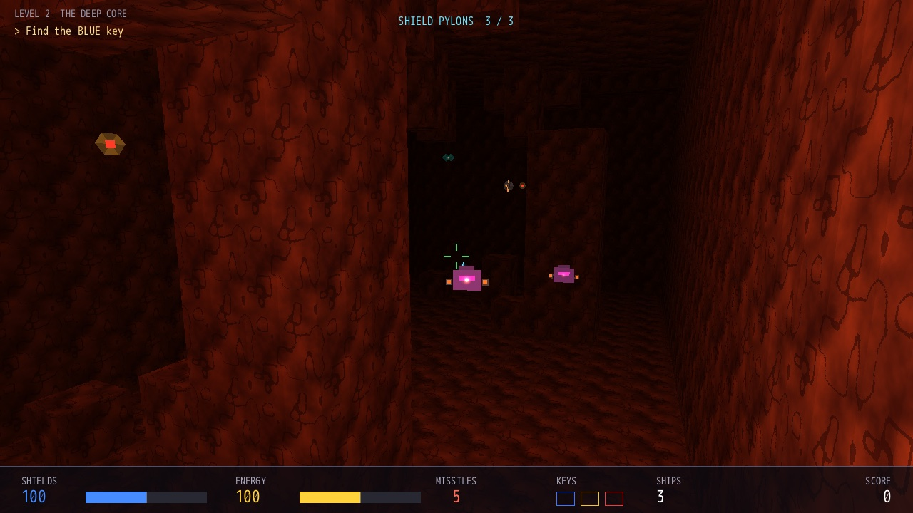
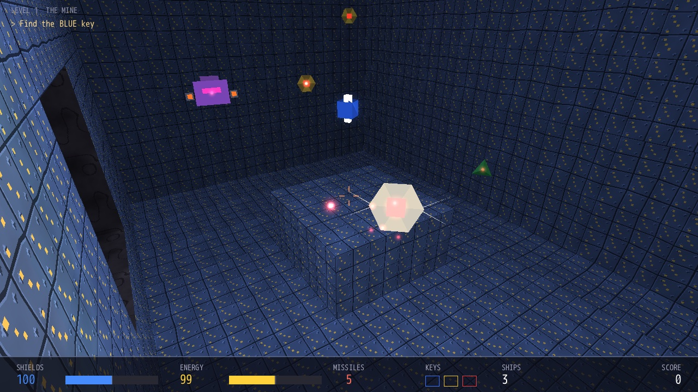
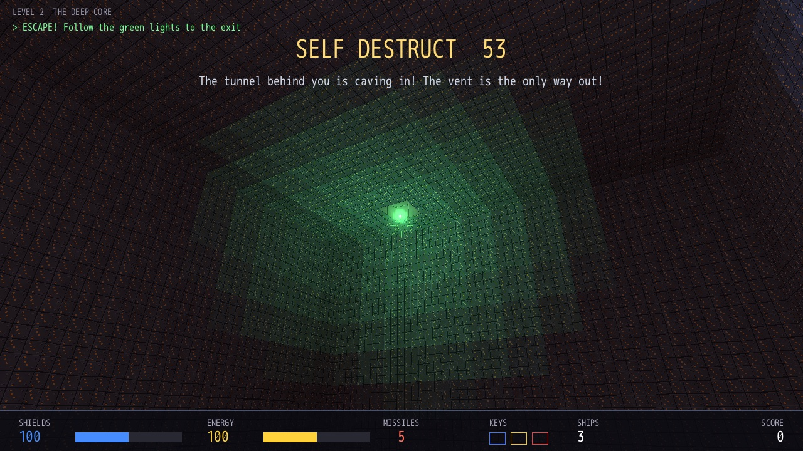
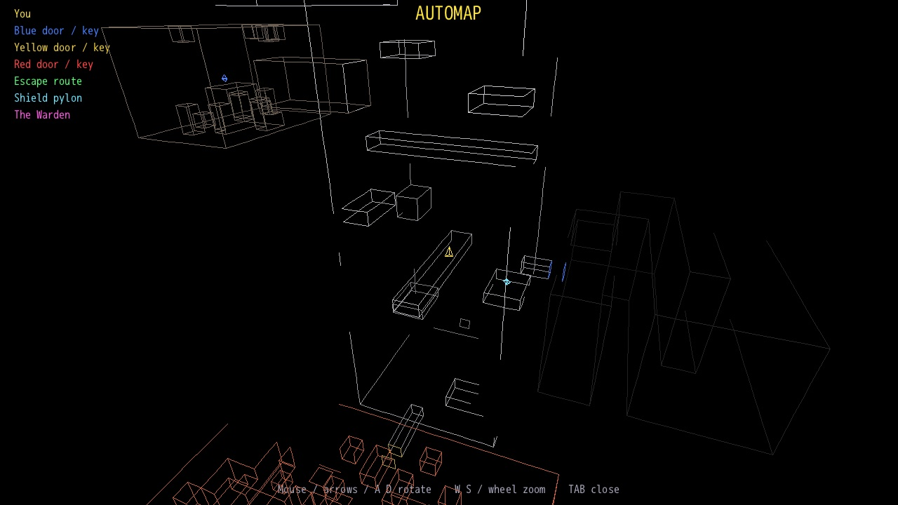

# Core Breach

**A six-degrees-of-freedom mine shooter, software-rendered in pure Ruby.**

Fly a small gunship through collapsed mine tunnels and a flooded reactor core.
Hunt down the keys, blast your way past drones, hunters and armoured turrets,
bring down the reactor or the Warden guarding the core, and get out before the
place goes up. It's a tribute to the tunnel shooters of the mid-90s: there's
no up or down, and you can loop, roll and strafe in every direction.

Built with [DragonRuby Game Toolkit](https://dragonruby.org/) on the
[d3d](https://github.com/webmatze/d3d) 3D engine, which started in this game.
There are no GPU shaders, no model files, and no image or audio files made by hand.
Every wall, robot, texture and sound comes from code.



| | |
|---|---|
|  |  |
|  |  |

## Features

- **True 6DOF flight**: pitch, yaw, roll and slide in any direction, with no
  gimbal lock and no fixed "up".
- **Two levels in a small campaign**, with score, lives and missiles carried
  over between them:
  1. **The Mine**: find the blue and red keys, destroy the reactor and escape
     through the hatch before the self-destruct countdown runs out.
  2. **The Deep Core**: descend a huge vertical shaft, collect three keys, bring
     down three shield pylons and the Warden guarding the core, then climb out
     through the escape vent while the tunnel caves in behind you.
- **Robots with their own tactics**: drones that keep their distance and shoot,
  hunters that ram you, heavy brutes, wall turrets armoured against lasers,
  and splitters that burst into two fast mini-hunters.
- **The Warden**: a shielded boss that fires plasma spreads and calls in drones.
  Its shield holds as long as any of its three pylons still stands.
- **Lasers, concussion missiles and flares**: flares stick to walls and are the
  only light in the blacked-out wing.
- **Keys and doors**, a self-destruct countdown with green beacons along the
  escape route, and cave-ins that seal the way back.
- **A 3D wireframe automap** of everything you've seen, with keys, doors,
  pylons and the Warden marked on it.
- **Procedural textures and sounds** for rock, metal, magma, tech panels,
  lasers, explosions and the alarm.



## Getting started

You need [DragonRuby GTK](https://dragonruby.org/). The project pins DragonRuby
Pro 7.13 in `Smaug.toml`, and any recent DragonRuby should run it.

```bash
git clone https://github.com/webmatze/core_breach.git
cd core_breach
smaug run            # with Smaug
# or
dragonruby .         # with the DragonRuby binary on your PATH
```

### Performance and the optional C extension

d3d has an optional C extension (DragonRuby Pro) for its hot loops: cell-grid
visibility, wall faces and the depth sort. Build it once per machine:

```bash
tools/build_ext.sh   # -> native/macos/d3d_ext.dylib (or native/linux-*/d3d_ext.so)
```

The game loads it at startup. With it, you can see 400 units instead of 140,
and far walls fade slowly into the dark instead of ending in black. Without it,
everything runs in pure Ruby with the shorter view. `F1` shows the frame rate,
the triangle count and which path is active. Render time per frame, measured
headless over 150 camera positions per level:

| Render path | View | The Mine | The Deep Core |
|---|---|---|---|
| With C extension | 400 | ~0.9 ms | ~1.3 ms |
| Pure Ruby | 140 | ~4.9 ms | ~6.6 ms |

The build output in `native/` isn't committed.

## Controls

| Key | Action |
|---|---|
| Mouse / `↑` `↓` `←` `→` | Pitch and yaw |
| `W` / `S` | Thrust forward / reverse |
| `A` / `D` | Slide left / right |
| `R` / `F` | Slide up / down |
| `Q` / `E` | Roll |
| Left click / `Space` | Lasers |
| Right click / `Ctrl` | Concussion missile |
| `G` | Flare: sticks to walls and lights dark rooms for 20 s (costs 2 energy) |
| `Tab` | Automap (mouse / arrows / `A` `D` rotate, `W` `S` / wheel zoom) |
| `I` | Invert mouse |
| `Esc` | Pause |
| `1` / `2` on the title screen | Start directly at a level |
| `F1` | Frame rate, triangle count and render path |

**Gamepad:** the sticks fly, the triggers fire, `Y` drops a flare, the bumpers roll,
`A`/`B` slide up and down, and `Select` opens the automap.

## How to play

- The current objective is always shown in the top left corner. Doors open
  when you fly up to them with the matching key.
- Lasers cost energy; missiles are limited but hit hard and splash. Turrets
  shrug off lasers, so save a missile or two for them.
- Pick up shields, energy and missiles along the way. Shields and energy can
  be boosted up to 200.
- In the blackout wing, your headlight barely reaches the walls. Shoot flares
  ahead of you to see where you're going; at most six burn at once.
- The Warden can't be hurt while a pylon stands. The HUD counts the pylons
  left, and the automap marks the ones you've seen.
- When the reactor or the Warden goes down, the countdown starts. Follow the
  green lights to the exit. In the Deep Core, the tunnel behind you caves in,
  so the vent is the only way out.
- You have three spare ships. Losing one puts you back at the level's start
  with your keys; losing one with no spares left ends the game.



## How it works

DragonRuby has no 3D pipeline, no depth buffer and no shaders, but it can draw a
2D triangle with any part of a texture mapped onto it. d3d does all 3D math in
Ruby on the CPU and ends each frame with a sorted list of those triangles, like
the software renderers of the mid-90s. The game uses its cell-grid part:

- **The world is a grid of cubes** (`D3D::CellGrid`). Rooms and tunnels are
  carved out of solid rock as boxes, then roughened so the caverns look less
  boxy. Every face where an open cell meets a solid one becomes a wall. The
  same grid gives cheap collision, line of sight, doors and cave-ins.
- **Portal flood fill** decides what to draw: starting at the camera's cell, the
  visibility check only spreads through cell boundaries that are within view distance and inside
  the view frustum.
- **Walls** are backface-culled, subdivided by distance to hide DragonRuby's
  affine texture warping, clipped against the near plane and padded by 0.7 px to
  close hairline cracks.
- **Lighting** is flat per sub-quad: the room's tint, a headlight, coloured point
  lights (shots, explosions, lamps, flares), fog and the red alarm pulse, all
  applied through the sprite's colour tint.
- **Painter's algorithm** instead of a depth buffer: walls, robots and glow
  billboards go into one list sorted back to front. Robots are only drawn when
  a line-of-sight test reaches them, so they never show through rock.

The full walkthrough, with the maths and the DragonRuby details that mattered,
is in [docs/how-it-works.md](docs/how-it-works.md).



## Project layout

```
app/main.rb              entry point: loads d3d and its optional C extension
app/game.rb              game flow, flight, weapons, robot AI, boss, HUD, menus
app/entities.rb          ship, robots, boss, pylons, projectiles, pickups
app/level.rb             wraps a D3D::CellGrid with doors, exits, spawns and lamps
app/levels.rb            level order
app/levels/
  mine.rb                level 1: The Mine
  deep_core.rb           level 2: The Deep Core
app/meshes.rb            robot, boss, reactor and pickup models (D3D::FlatMesh)
lib/d3d/                 the d3d engine, vendored unchanged (see lib/d3d/SOURCE)
sprites/, sounds/        generated assets (see tools/generate_assets.py)
tools/                   asset generator, engine sync, C extension build, screenshots
docs/                    how the engine works, level plans, screenshots
```

## Development

```bash
python3 tools/generate_assets.py   # regenerate every texture and sound
tools/sync_d3d.sh [../d3d]         # copy the d3d engine into lib/d3d
tools/build_ext.sh                 # build d3d's C extension into native/
ruby tools/screenshots.rb          # headless staged scenes -> docs/screenshots/*.jpg
```

To change the engine, change it in the [d3d](https://github.com/webmatze/d3d)
repository and run `tools/sync_d3d.sh`; don't edit `lib/d3d` directly.

The screenshot run starts DragonRuby headless (SDL dummy video driver), stages
the scenes from `tools/screenshot_scenes.rb` with robots frozen in place,
reports exceptions, and converts the images to JPEG with macOS's `sips`.

Levels are plain Ruby in `app/levels/`: carve rooms, place doors, keys, lamps,
robots and turrets, and set the countdown and messages. Robot stats are in
`Robot::STATS` in `app/entities.rb`.

## Credits

- Game and engine by [webmatze](https://github.com/webmatze).
- Built with [DragonRuby Game Toolkit](https://dragonruby.org/). Its license
  terms are in `open-source-licenses.txt`.
